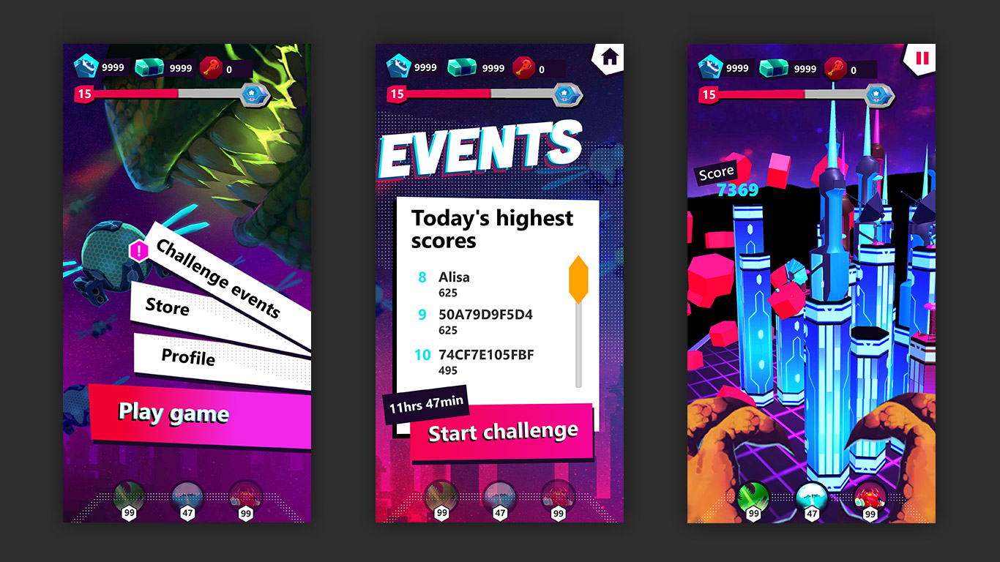

# Pinball Lizard

Pinball Lizard is a demo mobile game and full sample code to teach you how to implement key LiveOps concepts into your game using PlayFab and Unity.

## Deployment

To get the game running on your phone, you’ll first need to clone the project from GitHub. From there, you’ll need to build the game to your mobile device through Unity. Instructions for this can be found in Unity’s documentation for building on [Android](https://unity3d.com/learn/tutorials/topics/mobile-touch/building-your-unity-game-android-device-testing?playlist=17138) and [iOS](https://unity3d.com/learn/tutorials/topics/mobile-touch/building-your-unity-game-ios-device-testing?playlist=17138).

To play the game, you'll need to set up the backend through Azure PlayFab. We've created a [setup wizard](Deployment) to help. Follow the instructions in the setup wizard to configure with PlayFab.

Once your backend is configured, you can connect it to the phone app by entering the TitleID, which you used in the setup wizard. Once the game is connected to your backend, you can start playing and see the activity in your Game Manager.

## Built With

* [Azure PlayFab](https://playfab.com/)
* [Unity](https://unity3d.com/)
